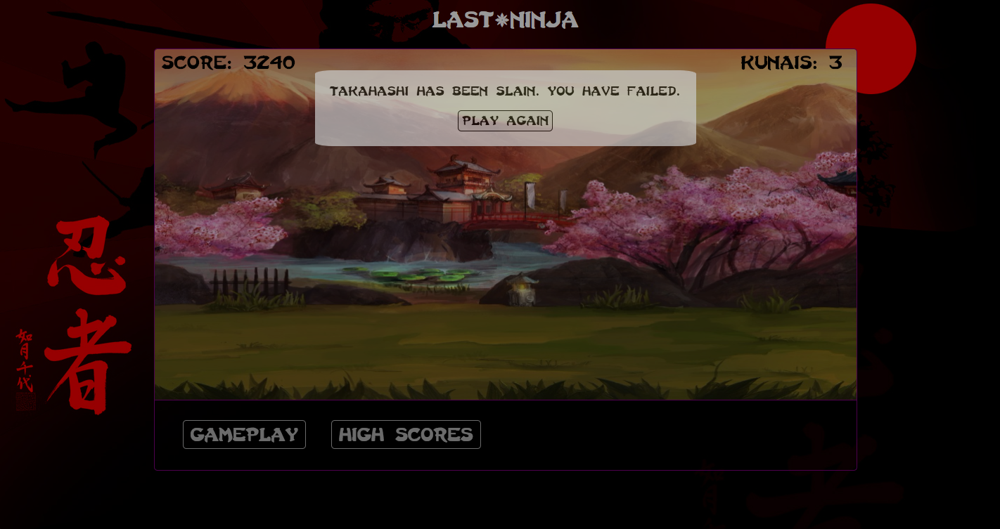

## Ninja

[Play Last Ninja](https://codhah92.github.io/Last_Ninja/)

### Background

Takahashi is the last ninja on Earth. He must dodge ninja stars sent from enemy ninjas and reach his home village.

Last Ninja is an 'Endless Flyer' inspired by Asteroids and Flappy Bird. It was developed in JavaScript and uses jQuery for DOM manipulation and HTML5 Canvas for smooth 2D rendering.



### How To Play

A single ninja star will lead to Takahashi's demise. Press `W, A, S, D` to move `UP, LEFT, DOWN, RIGHT`, respectively. Press `K` to throw a kunai knife to block an incoming ninja star. Press `J` to rapidly jump a small, vertical distance. Press `T` to toggle music. Help Takahashi get back to his village!

### Performance Features

#### Scrolling Background

A scrolling background was created using the drawImage function from HTML5 Canvas. By adding two identical background images
and immediately repositioning the x-coordinate to 0 once the x-coordinate reached the end of the first image, I was able to create the illusion of a background in perpetual motion.

```javascript
draw(ctx) {
  const imageRepository = new function() {
    this.background = new Image();
    this.background.src = "assets/ninja_map.jpg";
  };

  ctx.drawImage(
    imageRepository.background,
    this.xPos + this.width,
    this.yPos,
    this.width,
    this.height
  );

  ctx.drawImage(
    imageRepository.background,
    this.xPos + this.width,
    this.yPos,
    this.width,
    this.height
  );

  this.move();
  if (this.xPos < -1400){
    this.xPos = 0;
  }
}

move() {
  this.xPos += this.speed;
}
```

#### Audio / Music Toggling

Sound effects and music toggling were controlled with JavaScript's HTML5AudioElement Web API. Audio files were imported as mp3 files. Music toggling was enabled through API functions including `pause`, `play`, and `load`.

```javascript
  this.themeSong = new Audio('./assets/audio/ninja_theme.mp3');

  toggleSound() {
    if (this.songIsPlaying) {
      this.songIsPlaying = false;
      this.themeSong.pause();
    } else {
      this.songIsPlaying = true;
      this.themeSong.play();
    }
  }
```
